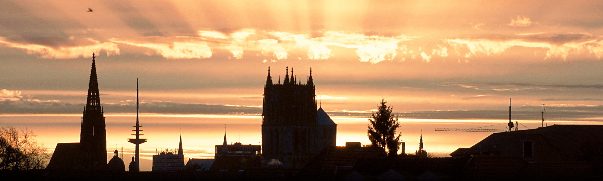

# Computer Science Education Research

I work as a research associate and PhD student at the Computer Science Department of [Westfälische Wilhelms-Universität Münster][wwu] in the [working group of Prof. Dr. Jan Vahrenhold][agv] (Efficient Algorithms and Algorithm Engineering).

As a member of the [Committee on European Computing Education][cece], a joint project of [ACM Europe][acm-e] and [Informatics Europe][ie], I helped gathering data regarding informatics and digital literacy in European schools. I also built a collaborative [map][cece-map] for visualization and world-wide access to this data. The data is about to be published in a report targeting decision makers.

At the department I work on informatics tutor (teaching assistants) training and try to learn from informatics teacher education in this context. I also coordinate and support project seminars and lectures of the group.

[wwu]: https://wwu.de
[agv]: https://www.uni-muenster.de/Informatik.AGVahrenhold/
[cece]: https://cece.wwu.de
[acm-e]: https://europe.acm.org
[ie]: https://informatics-europe.org
[cece-map]: http://cece-map.informatics-europe.org

---

**&copy; 2017 [Mirko Westermeier][mw]** -
[mirko@westermeier.de][mail] -
[@memowe][twitter]  
Grevener Straße 12 - 48149 Münster - Germany

 

[mw]: http://mirko.westermeier.de
[mail]: mailto:mirko@westermeier.de
[twitter]: https://twitter.com/memowe
